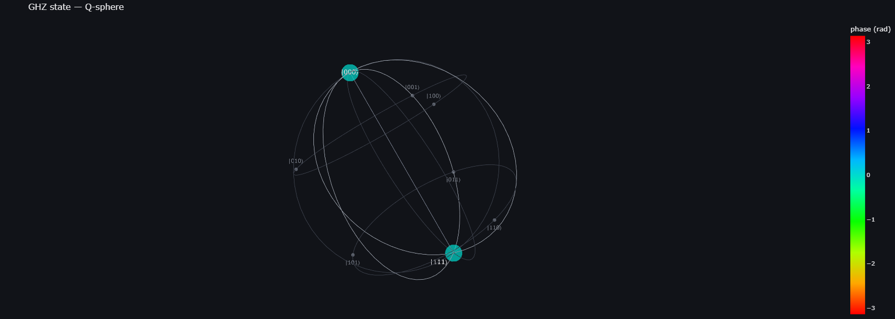
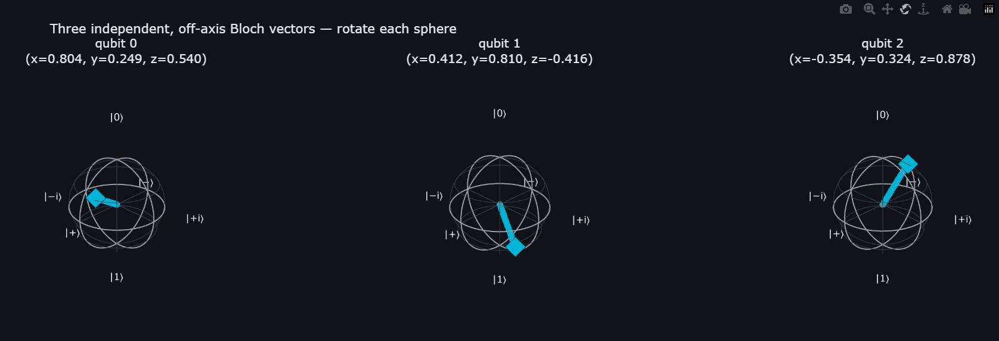
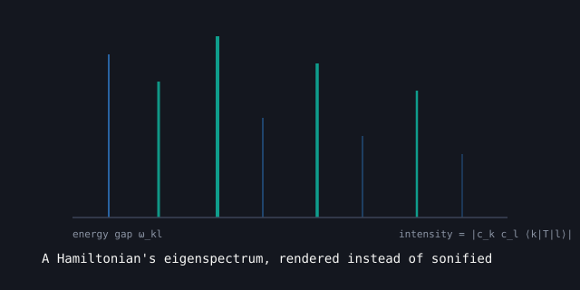

::: {.circuit-rule}
:::

::: {.status-readout}
STATUS · MIT license · on PyPI · Qiskit Ecosystem submission planned, not yet listed
:::

## The problem

Qiskit's built-in `plot_state_qsphere` and `plot_bloch_multivector` return static `matplotlib` figures. Fine for a paper, but hard to actually explore — you can't rotate a Q-sphere to see its phase structure or check exactly where a Bloch vector points from a flat PNG.

## What it does

`qiskit-stateviz` gives you interactive equivalents that take the same `Statevector` / `DensityMatrix` objects you already have:

```python
from qiskit import QuantumCircuit
from qiskit.quantum_info import Statevector
from qiskit_stateviz import plot_qsphere_interactive, plot_bloch_multivector_interactive

qc = QuantumCircuit(3)
qc.h(0)
qc.cx(0, 1)
qc.cx(1, 2)  # GHZ state

sv = Statevector(qc)

fig = plot_qsphere_interactive(sv, title="GHZ state")
fig.show()

fig2 = plot_bloch_multivector_interactive(sv)
fig2.show()
```

Rotate, zoom, and hover for exact amplitude/phase/probability at each basis state.

::: {layout-ncol="2"}



:::

## Emission-spectrum rendering (merged from Qiskit EigenLight)

`qiskit-stateviz` also renders a Hamiltonian's eigenspectrum as an emission spectrum — spectral lines positioned at true eigenvalue gaps, colored and intensity-scaled from the actual coherence structure of the evolving state, rather than a stylized stand-in for it. This was originally its own standalone package, `Qiskit-EigenLight`; it's now merged in here rather than maintained as a second small package with its own release cadence.



The same honest limitations carry over unchanged: the probe operator defaults to uniform all-pairs coupling rather than a real atom's transition operator, and everything is unitary — no dissipation, so lines are infinitely sharp.

## Why this exists

There's real prior art, and it's worth naming rather than pretending this fills an empty gap:

- **[Kaleidoscope](https://github.com/QuSTaR/kaleidoscope)** (Paul Nation, IBM Quantum) has interactive Plotly `qsphere()` and `bloch_sphere()` functions with rendering that still works well — but its Qiskit integration layer hard-requires `qiskit-terra` and `qiskit-ibmq-provider`, both merged or deprecated since Qiskit 1.0, so it fails on any current install.
- **[plotly-qsphere](https://github.com/crystaldot/plotly-qsphere)** is a small, focused interactive Q-sphere on Plotly, but doesn't cover Bloch spheres, density matrices, or mixed states.
- **[Quantum-Glasses](https://github.com/qiskit-community/quantum-glasses)** is an actual Qiskit Ecosystem member, but it's a Tkinter desktop GUI limited to single-qubit states — not a notebook-native tool.

`qiskit-stateviz` is built fresh against current Qiskit (`>=2.0`, tested against 2.5.x), takes `Statevector`/`DensityMatrix` directly with no legacy dependencies, and covers both Q-sphere and per-qubit Bloch views in one package.

## An honest limitation

Like Qiskit's own `plot_bloch_multivector`, the per-qubit Bloch view only shows single-qubit marginals — reduced density matrices. A maximally entangled qubit's Bloch vector has zero length even though the full joint state is pure, so **this view cannot show entanglement**. Use `plot_qsphere_interactive` for multi-qubit structure instead. Worth knowing before you read too much into a short Bloch vector.

## Testing

Amplitude/phase and partial-trace math are cross-checked in the test suite against Qiskit's own `partial_trace` and `expectation_value` reference implementations — not just asserted against expected output shapes.

## Roadmap

- Interactive `plot_state_city` / `plot_state_hinton` equivalents
- `ipywidgets` slider for live circuit-parameter sweeps

## Links

- [Repository](https://github.com/RexRowan/Qiskit-StateViz){target="_blank"}
- [Qiskit Ecosystem listing](https://qiskit.github.io/ecosystem/p/e9f6e045/){target="_blank"} — classified `Tooling`, labeled `quantum information`
- `pip install qiskit-stateviz`
